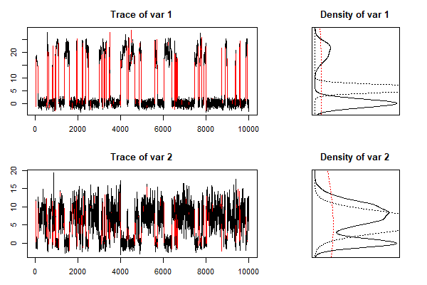
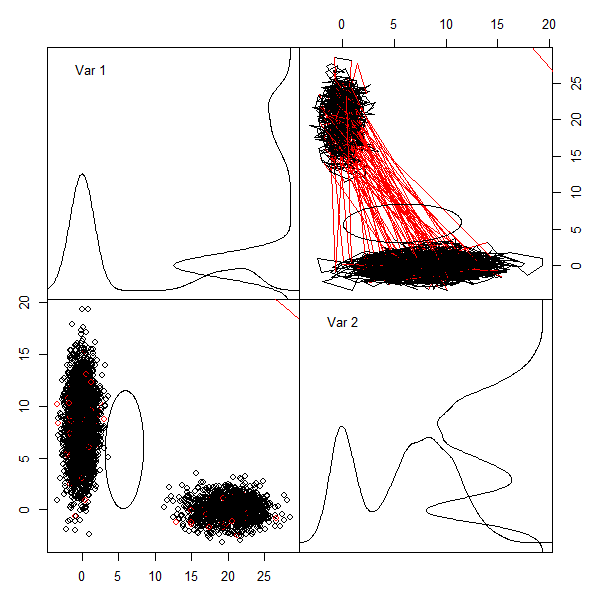

# aMTM -- Adaptive Multiple-Try Metropolis algorithm

## Description of the Package

This **R** package implements the aMTM algorithm of Fontaine and Bédard (2020+). The sampling algorithm is implemented in a **C++** function accessed from a wrapper function in **R**. 


## Example of Utilization

### Installation

You can install the R package directly from GitHub using the **devtools** package function `install_github` using the following **R** command :

```R
devtools::install_github("fontaine618/aMTM")
```

### The target density

The target density has to be supplied as the log-density and the **R** function may take some arguments and must be vectorized. 

For example, let us consider a mixture of two Gaussian densities in two dimensions:
$$ 
\pi(x) = w_1\varphi(x\vert\mu_1,\Sigma_1)+w_2\varphi(x\vert\mu_2,\Sigma_2), $$
with
$$
\begin{aligned}
	w_1&=0.3, &
	\mu_1 &= (0,20)^\top, & 
	\Sigma_1 &= \text{diag}(9,1);\\
	w_2&=0.7, &
	\mu_2 &= (8,0)^\top, & 
	\Sigma_2 &= \text{diag}(1,9).
\end{aligned}
$$
In **R**, this may be written as follows:
```R
# the means
mu1 <- c(20,0); mu2 <- c(0,8)
# the covariances
Sig1 <- matrix(c(9,0,0,1),2,2,T) 
Sig2 <- matrix(c(1,0,0,9),2,2,T)
# the precision matrices
S1 <- solve(Sig1); S2 <- solve(Sig2)
# constant terms
d1 <- (det(2*3.1416*Sig1))^-0.5 
d2 <- (det(2*3.1416*Sig2))^-0.5
# mixture weights
w1 <- 0.3; w2 <- 1-w1
# vectorized lo-density
logp <- function(X, p){
   if(is.vector(X)) X <-t(X)
   X <- as.matrix(X)
   apply(X, 1, function(x){
     log(p$w1*p$d1*exp(-t(x-p$mu1)%*%p$S1%*%(x-p$mu1)/2)+
         p$w2*p$d2*exp(-t(x-p$mu2)%*%p$S2%*%(x-p$mu2)/2))
   })
}
# the list of parameters
p <- list(w1=w1,w2=w2,d1=d1,d2=d2,mu1=mu1,mu2=mu2,S1=S1,S2=S2)
```
Then, we can evaluate the log-density as follows:
```R
X <- matrix(1:6, nrow=3)
X
>      [,1] [,2]
> [1,]    1    4
> [2,]    2    5
> [3,]    3    6
logp(X, p)
> [1] -4.682056 -5.793167 -8.015389
```

### aMTM Sampling
The `aMTM` function requires minimally the following input:

* `target` : the target vectorized log-density;
* `N` : the desired sample size;
* `K` : the number of proposals in the MTM sampling;
* `x0` : the initial state of the chain;
* `parms` : the parameters to be passed to `target` (if necessary).

By default, the `aMTM` function uses the following settings:

* `sig0` : the initial covariances are set the identity matrices of the correct dimension;
* `mu0` : the initial means (for AM and ASWAM updates) are set to vectors of zeros;
* `lam0` : the initial scales are set to $(2.38)^2/d$ following optimal scale results;
* `adapt` : the adaptation performed is ASWAM updates;
* `global` : any proposal is updated when selected;
* `scale` : no adaptation of the scales of unselected densities is performed;
* `local` : the local updates are not used;
* `proposal` : independent proposal are used;
* `accrate` : the target acceptance rate (ASWAM and RAM updates) is 0.50;
* `gamma` : the adaptation stepsize is given by $n^{-0.7}$;
* `weight` : the MTM sampling weights are proportional to the target density;
* `burnin` : no burnin is performed. 

We produce a sample of size $N=10000$ using $K=2$ proposals where the initial covariances are multiples of the identity matrix and where we use local updates:

```R
# number of proposal and dimension
K<-2; d<-2
# initial covariances
sig0 = array(0, dim = c(d,d,K))
for(k in seq(K)) sig0[,,k] <- diag(d)*10^k
# aMTM sampling
library(aMTM)
set.seed(1)
mcmc <- aMTM(target=logp, N=1e4, K=K, x0=c(0,0), parms=p,
             sig0 = sig0, adapt = 2, local = T, accrate = 0.5)
# sample statistics
mean(mcmc$X[,1]>5)
> [1] 0.2897
mcmc$acc.rate
> [1] 0.5016 
mcmc$sel.prop
>      1      2 
> 0.9800 0.0200
```

### Output
The chain produced from the `aMTM` function is of class `mcmc` in order to insure compatibility with other well-known MCMC packages. For example, we can perform the Geweke diagnostic on the sample,
```R
(diag <- coda::geweke.diag(mcmc$X))
> Fraction in 1st window = 0.1
> Fraction in 2nd window = 0.5 
> 
>    var1    var2 
> -0.1348 -0.2013
pnorm(abs(diag$z),lower.tail=FALSE)*2
>      var1      var2 
> 0.8927779 0.8404725 
```
or the Gelman diagnostic using parallel independent chains,
```R
mcmclist <- lapply(seq(10), function(i){
   set.seed(i)
   mcmclist[[i]] <- aMTM(target=logp,N=1e4,K=K,x0=c(0,10), 
   						 parms=p,sig0=sig0,adapt='ASWAM',
   						 local=T,accrate=0.5)$X
}
coda::gelman.diag(mcmclist)
> Potential scale reduction factors:
>    
>      Point est. Upper C.I.
> [1,]       1.02       1.03
> [2,]       1.01       1.02
> 
> Multivariate psrf
> 
> 1.02
```
or get the Monte Carlo estimate of $\mathbb E\{X\}$ along with an estimate of the covariance of the MC estimate, 
```R
mcmcse::mcse.multi(mcmc$X)$est
>     var1     var2 
> 5.834973 5.781332 
mcmcse::mcse.multi(mcmc$X)$cov/N
>            [,1]       [,2]
> [1,]  0.5686868 -0.2347880
> [2,] -0.2347880  0.1035699
```

### Visualization
We provide a graping function that can help visualizing the behavior of the different proposal density. We can produce the trace plots in each components along with a smoothed empirical distribution,

```R
plot.aMTM(mcmc, pairs=F)
```



or plots of the pairwise marginals

```R
plot.aMTM(mcmc, type='b')
```



## Built with

This **R** package was built using the **devtools** package. The optimization routine is written in **C++**.

## Author

[Simon Fontaine](mailto:fontaines@dms.umontreal.ca)

## Lisense

GPL-2

## Acknowledgments

The covariance updates use rank one Cholesky updates which are performed using a **C++** code snippet written by **Jouni Helske** available [here](https://github.com/helske/ramcmc/blob/master/inst/include/ramcmc.h).

## References

Andrieu, C. and Thoms, J. (2008). *A tutorial on adaptive MCMC*. Statistics and computing, 18:4, 343-373.

Craiu, R.V. and Lemieux., C. (2007). *Acceleration of the multiple-try Metropolis algorithm using
antithetic and stratifed sampling*. Statistics and computing, 17:2, 109.
 
Fontaine, S. and Bedard, M. (2020+). *An adaptive multiple-try Metropolis algorithm*. To be submitted.

Haario, H., Saksman, E., Tamminen, J. et al. (2001). *An adaptive Metropolis algorithm*. Bernoulli, 7:2, 223-242.

Helske, J. (2018). *ramcmc: Robust Adaptive Metropolis Algorithm*. R package version 0.1.0-1, http://github.com/helske/ramcmc.

Liu, J.S., Liang, F. and Wong, W.H. (2000). *The Multiple-Try Method and Local Optimization in Metropolis Sampling*. 
Journal of the American Statistical Association, 95:449, 121-134.

Vihola, M. (2012). *Robust adaptive Metropolis algorithm with coerced acceptance rate*. Statistics and Computing, 22:5, 997-1008.
